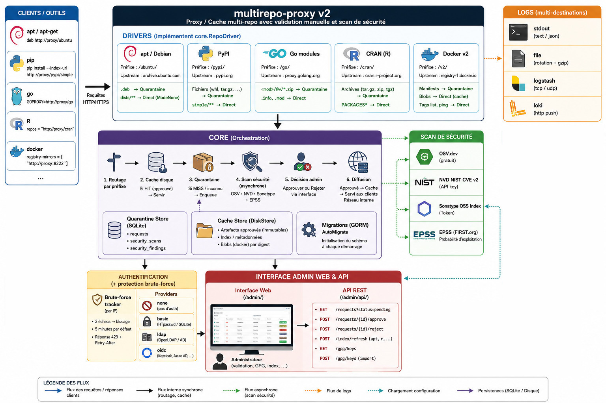

# multirepo-proxy v2

## Overview

**multirepo-proxy** is a universal proxy-cache for package repositories. It sits between your tools (apt, pip, go, R, Docker) and their public or private repositories, and submits every new artifact to **manual validation** before it is distributed on the internal network.

**Key features:**

- **Multi-repo proxy** — apt/Debian, PyPI, Go modules, CRAN, npm, Docker v2 from a single entry point
- **Quarantine** — any unknown artifact is held, reviewed and approved or rejected by an administrator via the web interface
- **Automatic security scanning** — OSV.dev, NVD NIST and Sonatype OSS Index queried in parallel; CVEs enriched with EPSS scores
- **Auto-approval rules** — automatically approve packages below configured CVSS/EPSS thresholds
- **Cosign signature verification** — Docker images are verified via Cosign (Sigstore) before distribution; any anomaly triggers mandatory human validation
- **Disk cache** — approved artifacts are served locally without repeated network calls
- **Web admin interface** — multilingual (FR/EN/DE/ES/ZH/JA), package validation, user and group management, auto rules, CVE display
- **Authentication** — none, HTTP Basic (YAML / htpasswd / SQLite), LDAP/AD, OpenID Connect; built-in brute-force protection
- **Group-based access control** — granular permissions per repository and per action; optional auth per driver
- **MCP server** — manage the proxy directly from Claude via the Model Context Protocol
- **Multi-destination logging** — stdout, rotating file, Logstash, Grafana Loki
- **Native TLS** — HTTPS without an intermediate reverse proxy

**Typical use cases:**

- Secure CI/CD builds by isolating third-party packages behind a validation checkpoint
- Maintain an internal cache for air-gapped or bandwidth-limited environments
- Audit dependencies before they are introduced into a machine fleet

---

## Why this project?

I was looking for a lightweight proxy-cache for working on 4G and offline. Nexus Repository consumes 4–6 GB of RAM and reserves advanced security features for its paid edition. This program does not replace Nexus (which remains far more complete), but covers the main need with a very small memory footprint.

---

## Architecture

Multi-repo proxy/cache with manual validation. Each repository type is an independent **driver** implementing `core.RepoDriver`. The `Registry` orchestrates routing, caching and quarantine.



---

## Structure

```
multirepo-proxy/
├── config/
│   └── config.go           ← configuration structs + default values
├── cmd/
│   ├── root.go             ← main command — loads config, wires up drivers
│   ├── httpclient.go       ← outbound HTTP proxy configuration
│   ├── user.go             ← `user` sub-command (add/remove/list/passwd)
│   └── mcp.go              ← `mcp` sub-command — stdio MCP server
├── auth/
│   ├── auth.go             ← Authenticator interface + factory + brute-force wrapper
│   ├── bruteforce/
│   │   └── tracker.go      ← IP blocking after N failures (thread-safe)
│   ├── basic/
│   │   ├── basic.go        ← HTTP Basic middleware (RFC 7617)
│   │   └── store.go        ← HtpasswdStore + DBStore SQLite
│   ├── ldap/
│   │   └── ldap.go         ← LDAP/Active Directory middleware
│   └── oidc/
│       ├── oidc.go         ← OIDC middleware + login/callback/logout routes
│       └── session.go      ← HMAC-SHA256 signed session cookie
├── core/
│   ├── driver.go           ← RepoDriver interface + BaseDriver + FetchUpstream
│   ├── registry.go         ← Registry — routing, cache, quarantine, access control
│   ├── quarantine.go       ← QuarantineStore (Enqueue/Approve/Reject/Revoke/scan)
│   ├── groupstore.go       ← GroupStore — groups and permissions
│   ├── rules.go            ← RuleStore — auto-approval rules
│   ├── migrate.go          ← GORM AutoMigrate
│   ├── store.go            ← CacheStore interface + DiskStore
│   └── validators.go       ← Validator interface + implementations
├── security/
│   ├── security.go         ← common types, MultiScanner
│   ├── epss/               ← EPSS enrichment (FIRST.org)
│   ├── osv/                ← OSV.dev scanner
│   ├── nvd/                ← NVD NIST CVE v2 scanner
│   └── sonatype/           ← Sonatype OSS Index scanner (purl)
├── logs/
│   ├── logs.go             ← multi-backend Logger
│   ├── middleware.go       ← HTTPMiddleware (HTTP access log)
│   ├── file/               ← rotation + gzip
│   ├── logstash/           ← TCP/UDP
│   └── loki/               ← HTTP batch push
├── drivers/
│   ├── apt/                ← AptDriver (index, GPG, .deb quarantine)
│   ├── goproxy/            ← GoDriver (GOPROXY, .zip quarantine)
│   ├── pypi/               ← PyPIDriver (PEP 503, dependency prefetch)
│   ├── cran/               ← CRANDriver (PACKAGES index, archive quarantine)
│   ├── npm/                ← NpmDriver (npm registry protocol, .tgz quarantine)
│   └── docker/             ← DockerDriver (Distribution Spec v2, Bearer auth, Cosign)
├── serviceweb/
│   └── api/
│       ├── admin.go        ← admin REST API
│       ├── serve_ui.go     ← UI server + /admin/api/* routing
│       └── ui.html         ← web interface (multilingual, group/user/rule management)
├── main.go
├── config.yaml             ← example / development configuration
└── README.md
```

---

## Configuration

### YAML file

Searched in order:
1. `--config <path>`
2. `/etc/multirepo/config.yaml`
3. `./config.yaml`

```yaml
server:
  addr: ":8222"
  tls:
    enabled:   false
    cert_file: ""   # /etc/multirepo/tls/server.crt
    key_file:  ""   # /etc/multirepo/tls/server.key

storage:
  cache_dir: /var/cache/multirepo
  # Single SQLite database: quarantine, scans, users, groups, rules
  db_path:   /var/lib/multirepo/multirepo.db

auth:
  provider: basic   # none | basic | ldap | oidc

drivers:
  apt:
    enabled:      true
    prefix:       /ubuntu/
    upstream:     http://archive.ubuntu.com/ubuntu
    auth_required: true   # false = accessible without credentials
  docker:
    enabled:      true
    prefix:       /v2/
    upstream:     https://registry-1.docker.io
    auth_required: true
    cosign:
      enabled:           false   # true to enable signature verification
      require_signature: true    # false = warning only (no blocking)
      public_key_file:   ""      # path to PEM key — empty = presence only
  pypi:
    enabled:      true
    prefix:       /pypi/
    upstream:     https://pypi.org
    auth_required: true
  go:
    enabled:      true
    prefix:       /go/
    upstream:     https://proxy.golang.org
    auth_required: true
  cran:
    enabled:      true
    prefix:       /cran/
    upstream:     https://cran.r-project.org
    auth_required: true
  npm:
    enabled:      true
    prefix:       /npm/
    upstream:     https://registry.npmjs.org
    auth_required: true
```

### Environment variables

Any YAML key can be overridden via `MULTIREPO_<UPPERCASE_PATH>` (`.` → `_`):

| Variable | YAML equivalent |
|---|---|
| `MULTIREPO_SERVER_ADDR` | `server.addr` |
| `MULTIREPO_STORAGE_DB_PATH` | `storage.db_path` |
| `MULTIREPO_AUTH_PROVIDER` | `auth.provider` |
| `MULTIREPO_AUTH_DB_PATH` | `auth.db_path` |
| `MULTIREPO_AUTH_LOCAL_USERS` | `auth.local_users` |
| `MULTIREPO_AUTH_SESSION_SECRET` | `auth.session_secret` |
| `MULTIREPO_AUTH_LDAP_BIND_PASSWORD` | `auth.ldap.bind_password` |
| `MULTIREPO_AUTH_LDAP_GROUP_BASE_DN` | `auth.ldap.group_base_dn` |
| `MULTIREPO_AUTH_LDAP_GROUP_FILTER` | `auth.ldap.group_filter` |
| `MULTIREPO_AUTH_LDAP_GROUP_ATTRIBUTE` | `auth.ldap.group_attribute` |
| `MULTIREPO_AUTH_OIDC_CLIENT_SECRET` | `auth.oidc.client_secret` |
| `MULTIREPO_SECURITY_NVD_API_KEY` | `security.nvd.api_key` |
| `MULTIREPO_SECURITY_SONATYPE_TOKEN` | `security.sonatype.token` |
| `MULTIREPO_DRIVERS_DOCKER_USERNAME` | `drivers.docker.username` |
| `MULTIREPO_DRIVERS_DOCKER_PASSWORD` | `drivers.docker.password` |
| `MULTIREPO_DRIVERS_DOCKER_COSIGN_PUBLIC_KEY_FILES` | `drivers.docker.cosign.public_key_files` |

Priority: **CLI flag > env variable > YAML > default**.

### Starting the server

```bash
# Development
./multirepo-proxy

# Explicit file
./multirepo-proxy --config /etc/multirepo/config.yaml

# Everything via environment variables
MULTIREPO_SERVER_ADDR=":9000" MULTIREPO_AUTH_PROVIDER="basic" ./multirepo-proxy
```

---

## Admin interface authentication

| `auth.provider` | Behavior |
|---|---|
| `none` (default) | No protection |
| `basic` | HTTP Basic — htpasswd / SQLite |
| `ldap` | HTTP Basic verified against LDAP / Active Directory |
| `oidc` | OpenID Connect (Keycloak, Google, Azure AD…) |

`auth.local_users: true` allows local database accounts to log in alongside LDAP or OIDC (see [dedicated section](#local-users-as-fallback-authlocal_users)).

### Auth database (`auth.db_path`)

The SQLite database for **users, groups and rules** can be separated from the quarantine database:

```yaml
storage:
  db_path: /var/lib/multirepo/multirepo.db   # quarantine + security scans

auth:
  db_path: /var/lib/multirepo/auth.db        # users + groups + rules
  provider: ldap                             # works with basic, ldap and oidc
```

If `auth.db_path` is empty, everything is stored in `storage.db_path` (default behavior).

This separation allows different backup policies: the quarantine database can be large and volatile, while the auth database is small and critical.

### Basic Auth — account sources

Credentials are verified in the following order:

**1. htpasswd file** *(formats `$2y$` bcrypt and `{SHA}`)*

```yaml
auth:
  basic:
    htpasswd_file: /etc/multirepo/htpasswd
```

```bash
htpasswd -B -c /etc/multirepo/htpasswd admin
```

**2. SQLite database** *(managed via CLI or web interface)*

On first open, an `admin` / `admin` account belonging to the `admin` group is created. **Change this password immediately.**

```bash
multirepo-proxy user passwd admin
multirepo-proxy user add alice --groups admin
multirepo-proxy user add bob   --groups "readers,ops"
multirepo-proxy user remove bob
multirepo-proxy user list
```

Both sources can coexist. In production, prefer environment variables for secrets.

### Per-driver authentication

When a provider is configured, each driver can be made accessible without credentials:

```yaml
auth:
  provider: basic

drivers:
  apt:
    auth_required: true    # login required
  pypi:
    auth_required: false   # accessible without credentials
  go:
    auth_required: false   # same — convenient for anonymous CI
```

`auth_required: false` disables both authentication AND group-based access control for that driver.

### Brute-force protection

```yaml
auth:
  brute_force:
    enabled:        true
    max_failures:   3     # failures before blocking
    block_duration: 5m    # IP block duration
```

- Applies to all providers.
- Blocked IP receives `429 Too Many Requests` + `Retry-After`.
- A successful login resets the counter.

### LDAP authentication

```yaml
auth:
  provider: ldap
  ldap:
    url:           ldap://ldap.corp:389      # or ldaps:// for TLS
    bind_dn:       cn=svc,ou=services,dc=corp,dc=local
    bind_password: ""    # or MULTIREPO_AUTH_LDAP_BIND_PASSWORD
    base_dn:       ou=users,dc=corp,dc=local
    user_filter:   "(uid=%s)"                # AD: "(sAMAccountName=%s)"
    tls_skip_verify: false
    timeout:       5s
```

#### LDAP group mapping

By default, an LDAP user's groups are read from the **local database** (Users tab in the UI — a local user with the same `uid` must exist).

For automatic mapping without manual management, configure `group_base_dn`:

```yaml
auth:
  provider: ldap
  ldap:
    # … connection …

    # Base DN for group search
    group_base_dn: "ou=groups,dc=corp,dc=local"

    # Filter — %s = user DN, %u = username/uid
    # OpenLDAP groupOfNames  : "(member=%s)"           ← default
    # Active Directory       : "(&(objectClass=group)(member=%s))"
    # posixGroup (memberUid) : "(memberUid=%u)"
    group_filter: "(member=%s)"

    # LDAP attribute holding the group name (default: "cn")
    group_attribute: cn

    # LDAP group name → local group name mapping
    # Only listed groups are forwarded; others are ignored.
    group_mapping:
      admins:        admin       # → implicit superadmin
      pkg-approvers: approvers   # → can approve/reject packages
      ops:           ops         # → local group "ops"
```

**Flow with mapping enabled:**

1. User authenticates → LDAP verifies the password and retrieves their DN
2. The proxy searches for groups where this DN is a `member` under `group_base_dn`
3. Each found LDAP group is translated to a local group via `group_mapping`
4. Permissions are computed from local groups (Groups tab in the UI)

> **Without `group_base_dn`** — create a local user in the UI with the same username as the LDAP account and assign the desired groups. The locally stored password is ignored (auth goes through LDAP).

| Env variable | YAML equivalent |
|---|---|
| `MULTIREPO_AUTH_LDAP_GROUP_BASE_DN` | `auth.ldap.group_base_dn` |
| `MULTIREPO_AUTH_LDAP_GROUP_FILTER` | `auth.ldap.group_filter` |
| `MULTIREPO_AUTH_LDAP_GROUP_ATTRIBUTE` | `auth.ldap.group_attribute` |

### OIDC authentication

```yaml
auth:
  provider: oidc
  session_secret: ""   # openssl rand -hex 32 — or MULTIREPO_AUTH_SESSION_SECRET

  oidc:
    issuer:        https://keycloak.corp/realms/myrealm
    client_id:     multirepo-proxy
    client_secret: ""   # or MULTIREPO_AUTH_OIDC_CLIENT_SECRET
    redirect_url:  https://proxy.corp:8222/admin/auth/callback
    scopes:        [openid, email, profile]
    session_ttl:   8   # hours
```

Callback URI to register with the provider: `https://proxy.corp:8222/admin/auth/callback`

### Local users as fallback (`auth.local_users`)

When the provider is `ldap` or `oidc`, `local_users: true` allows local database accounts to log in alongside it.

```yaml
auth:
  provider: ldap          # or oidc
  db_path:  /var/lib/multirepo/auth.db
  local_users: true       # enable DB fallback
```

**Behavior by provider:**

| Provider | With `local_users: true` |
|---|---|
| `ldap` | Tries LDAP first. If LDAP rejects → tries local DB. |
| `oidc` | If `Authorization: Basic` present → local DB. Otherwise → OIDC redirect. |

**Typical use cases:**

- Local `admin` account as an **emergency bypass** if the LDAP server is unreachable
- Service accounts for **CI/CD** pipelines that use Basic Auth rather than OIDC
- Migration period: test LDAP without cutting off access for existing accounts

Local account groups are read from the `auth.db_path` database (Users tab in the UI).

---

## Group-based access control

Groups define which repositories are accessible and which actions are allowed.

### Available permissions

| Permission | Description |
|---|---|
| `can_approve` | Approve / reject / revoke packages |
| `can_manage` | Manage groups, users and auto rules |
| `can_refresh_index` | Refresh apt and CRAN indexes |
| Repos | List of accessible repository types (`*` = all) |

The **`admin`** group is reserved — it implicitly grants all permissions.

### Configuration via the web interface

The admin interface exposes a **Groups** tab (visible only to `can_manage` users) for creating, editing and deleting groups.

### UI visibility by permission

| UI section | Required permission |
|---|---|
| Auto rules | `can_manage` |
| Users & Groups | `can_manage` |
| Approve/Reject/Revoke buttons | `can_approve` |
| Index section (refresh apt/CRAN) | `can_refresh_index` |
| Repository type filters | Limited to the group's repos |

---

## Auto-approval rules

If all active rules pass after the scan, the package is automatically approved. Without rules, all packages remain in manual review.

### Rule types

| Type | Description |
|---|---|
| `cvss_max` | Maximum CVSS score on a single vulnerability (0–10) |
| `epss_max` | Maximum EPSS score on a single vulnerability (0–1) |
| `cvss_sum` | Sum of CVSS scores across all vulnerabilities |
| `cvss_epss_sum` | Sum of CVSS×EPSS products |

Rules can be scoped to a repository type (`apt`, `docker`, etc.) or applied to all (`*`).

---

## Security scanning

For each new package placed in quarantine, the configured scanners are queried in parallel, then CVEs are enriched by EPSS.

### Supported ecosystems

| Driver | OSV | NVD | Sonatype | Signature |
|---|---|---|---|---|
| `go` | Go | yes | `pkg:golang/…` | — |
| `pypi` | PyPI | yes | `pkg:pypi/…` | — |
| `apt` | Debian | yes | `pkg:deb/…` | GPG |
| `cran` | CRAN | yes | `pkg:cran/…` | — |
| `npm` | npm | yes | `pkg:npm/…` | — |
| `docker` | — | — | — | Cosign (Sigstore) |

### Configuration

```yaml
security:
  osv:
    enabled: true
    timeout: 10s

  nvd:
    enabled: true
    api_key: ""   # MULTIREPO_SECURITY_NVD_API_KEY — free at nvd.nist.gov
    timeout: 15s

  sonatype:
    enabled: false
    token: ""     # MULTIREPO_SECURITY_SONATYPE_TOKEN — free at ossindex.sonatype.org
    timeout: 15s

  epss:
    enabled: true
    timeout: 10s
```

### CVSS severities

| Score | Severity |
|---|---|
| ≥ 9.0 | CRITICAL |
| ≥ 7.0 | HIGH |
| ≥ 4.0 | MEDIUM |
| > 0.0 | LOW |

---

## Web admin interface

Accessible at `http://localhost:8222/admin/`

### Features

- **Multilingual** — FR 🇫🇷 / EN 🇬🇧 / DE 🇩🇪 / ES 🇪🇸 / ZH 🇨🇳 / JA 🇯🇵 — language auto-detected from the browser, persisted in `localStorage`, selector in the header
- **Username** — displayed in the header when authentication is active
- **Package validation** — list filtered by status and repository type, quick actions (approve / reject / revoke) or via the detail drawer
- **Security report** — CVE, CVSS, EPSS, description, source in each package's drawer
- **Decision history** — who approved / rejected and when, with comment
- **User management** — create, edit groups, change password, delete
- **Group management** — permissions and accessible repositories per group
- **Auto-approval rules** — create, enable / disable CVSS/EPSS thresholds
- **Index refresh** — apt and CRAN

---

## MCP server

The `mcp` command starts a [Model Context Protocol](https://modelcontextprotocol.io) server on **stdio**, allowing Claude (Desktop or Code) to manage the proxy directly.

```bash
multirepo-proxy mcp
```

### Claude Desktop configuration

`~/Library/Application Support/Claude/claude_desktop_config.json` (macOS):

```json
{
  "mcpServers": {
    "multirepo": {
      "command": "/usr/local/bin/multirepo-proxy",
      "args": ["mcp"],
      "env": {
        "MULTIREPO_STORAGE_DB_PATH": "/var/lib/multirepo/multirepo.db"
      }
    }
  }
}
```

### Available MCP tools

| Tool | Description |
|---|---|
| `stats` | Summary: pending / approved / rejected |
| `list_packages` | List with `status` and `repo_type` filter |
| `get_package` | Package details + vulnerabilities |
| `approve_package` | Approve (with optional comment) |
| `reject_package` | Reject |
| `revoke_package` | Revoke (puts back to pending) |
| `get_security_report` | Formatted CVE report |
| `list_users` | List users |
| `create_user` | Create a user |
| `delete_user` | Delete a user |
| `set_password` | Change a password |
| `list_groups` | List groups and permissions |
| `list_rules` | Auto-approval rules |
| `set_rule_enabled` | Enable / disable a rule |

The MCP server opens the SQLite database directly — the proxy does not need to be running.

---

## Drivers

### apt — Ubuntu/Debian

| | |
|---|---|
| Prefix | `/ubuntu/` |
| Upstream | `http://archive.ubuntu.com/ubuntu` |

| Files | Quarantine mode |
|---|---|
| `pool/**/*.deb` | ModeSelf — manual validation |
| `dists/**` (Release, Packages…) | ModeNone — direct |

Validation: GPG signature (`_gpgorigin`) + MD5 cross-check against the `Packages` index.

```
# /etc/apt/sources.list
deb http://my-proxy:8222/ubuntu/ jammy main restricted universe
```

### go — Go modules (GOPROXY)

| | |
|---|---|
| Prefix | `/go/` |
| Upstream | `https://proxy.golang.org` |

| Files | Mode |
|---|---|
| `*.zip` | ModeSelf |
| `.info`, `.mod`, `@latest` | ModeNone |

Pending response: **404** (the `go` client falls back to the next proxy in `GOPROXY`).

```bash
GOPROXY=http://my-proxy:8222/go/,direct go get example.com/pkg
```

### pip — PyPI (PEP 503)

| | |
|---|---|
| Prefix | `/pypi/` |
| Upstream | `https://pypi.org` |

| Files | Mode |
|---|---|
| `*.whl`, `*.tar.gz`, `*.zip`… | ModeSelf |
| `simple/**` (HTML index) | ModeNone |

Automatic prefetch of dependencies declared in `METADATA` (4 workers).

```bash
pip install --index-url http://my-proxy:8222/pypi/simple/ fastapi
```

### r — CRAN

| | |
|---|---|
| Prefix | `/cran/` |
| Upstream | `https://cran.r-project.org` |

```r
install.packages("ggplot2", repos = "http://my-proxy:8222/cran/")
```

### npm — Node.js packages

| | |
|---|---|
| Prefix | `/npm/` |
| Upstream | `https://registry.npmjs.org` |

| Files | Mode |
|---|---|
| `*/-/*.tgz` (tarballs) | ModeSelf — manual validation |
| `/:package` (metadata JSON) | ModeNone — direct |

The `dist.tarball` URLs in metadata JSON responses are rewritten to point to the proxy, so npm/yarn/pnpm download tarballs through the quarantine pipeline.

Pending response: **503** with `Retry-After: 60` (npm retries automatically on 503).

```bash
# npm
npm config set registry http://my-proxy:8222/npm/

# yarn
yarn config set registry http://my-proxy:8222/npm/

# pnpm
pnpm config set registry http://my-proxy:8222/npm/
```

### docker — Distribution v2 (OCI)

| | |
|---|---|
| Prefix | `/v2/` (required by the OCI spec) |
| Upstream | `https://registry-1.docker.io` |

| Requests | Mode |
|---|---|
| `manifests/<tag\|digest>` | ModeSelf — manual validation |
| `blobs/sha256:<digest>` | ModeNone (immutable) |

Automatic Bearer token. Optional credentials for private registries (`username` / `password` or env variables).

#### Cosign signature verification

When Cosign verification is enabled, each Docker manifest is checked **before** quarantine:

1. The proxy looks for the signature artifact under the tag `sha256-<digest>.sig` in the same registry
2. If a public key is configured, the ECDSA signature is verified cryptographically
3. **On failure** (signature absent, invalid or unreachable): the image is quarantined with `require_human_review = true`, which **blocks any auto-approval** — only an administrator can manually validate or reject

```yaml
drivers:
  docker:
    cosign:
      enabled: true
      require_signature: true     # false = optional signature (log warning only)
      public_key_files:           # optional — empty = presence check only
        - /etc/multirepo/cosign-teamA.pub
        - /etc/multirepo/cosign-teamB.pub
```

The signature is valid if it matches **at least one** key in the list.

Generate a Cosign key pair:

```bash
cosign generate-key-pair          # produces cosign.key + cosign.pub
# Sign an image:
cosign sign --key cosign.key registry.corp/myimage:latest
```

Environment variable: `MULTIREPO_DRIVERS_DOCKER_COSIGN_PUBLIC_KEY_FILES`

```json
// /etc/docker/daemon.json
{ "registry-mirrors": ["http://my-proxy:8222"] }
```

---

## Admin REST API

`/admin/api/` — protected by the same authentication middleware as the UI.

### Packages

| Method | URL | Description |
|---|---|---|
| GET | `/admin/api/requests` | List (`?status=pending&repo=apt`) |
| GET | `/admin/api/requests/{id}` | Package details |
| POST | `/admin/api/requests/{id}/approve` | Approve — `{"comment":"…"}` |
| POST | `/admin/api/requests/{id}/reject` | Reject |
| POST | `/admin/api/requests/{id}/revoke` | Revoke |
| GET | `/admin/api/requests/history/{id}` | Decision history |
| GET | `/admin/api/me` | Permissions of the logged-in user |

### Groups & Users

| Method | URL | Description |
|---|---|---|
| GET | `/admin/api/groups` | List groups |
| POST | `/admin/api/groups` | Create a group |
| PUT | `/admin/api/groups/{name}` | Update a group |
| DELETE | `/admin/api/groups/{name}` | Delete a group |
| GET | `/admin/api/users` | List users |
| POST | `/admin/api/users` | Create a user |
| PUT | `/admin/api/users/{username}` | Update groups |
| PUT | `/admin/api/users/{username}/password` | Change password |
| DELETE | `/admin/api/users/{username}` | Delete a user |

### Rules

| Method | URL | Description |
|---|---|---|
| GET | `/admin/api/rules` | List rules |
| POST | `/admin/api/rules` | Create a rule |
| PUT | `/admin/api/rules/{id}` | Update / enable / disable |
| DELETE | `/admin/api/rules/{id}` | Delete |

### Index & GPG

| Method | URL | Description |
|---|---|---|
| POST | `/admin/api/index/refresh?repo=apt` | Refresh apt index |
| POST | `/admin/api/index/refresh?repo=r` | Refresh CRAN index |
| GET | `/admin/api/gpg/keys` | List GPG keys |
| POST | `/admin/api/gpg/keys` | Import a GPG key (ASCII-armored) |

---

## Adding a new driver

1. Create `drivers/myrepo/driver.go` and implement `core.RepoDriver`
2. Add the config in `config/config.go`:

```go
type MyRepoConfig struct {
    Enabled      bool   `mapstructure:"enabled"`
    Prefix       string `mapstructure:"prefix"`
    Upstream     string `mapstructure:"upstream"`
    AuthRequired bool   `mapstructure:"auth_required"`
}
```

3. Register it in `cmd/root.go`:

```go
if cfg.Drivers.MyRepo.Enabled {
    registry.Register(myrepo.New(cfg.Drivers.MyRepo))
}
```

4. Add in `config.yaml`:

```yaml
drivers:
  myrepo:
    enabled:      true
    prefix:       /myrepo/
    upstream:     https://upstream.example.com
    auth_required: true
```

The cache, quarantine, admin API, MCP server and environment variables work automatically.

---

## Container deployment

```yaml
# docker-compose.yml
services:
  proxy:
    image: multirepo-proxy
    ports:
      - "8222:8222"
    volumes:
      - ./config.yaml:/etc/multirepo/config.yaml:ro
      - ./tls:/etc/multirepo/tls:ro
      - proxy-cache:/var/cache/multirepo
      - proxy-data:/var/lib/multirepo
    environment:
      MULTIREPO_AUTH_PROVIDER: "basic"
      MULTIREPO_AUTH_SESSION_SECRET: "${SESSION_SECRET}"
      MULTIREPO_DRIVERS_DOCKER_PASSWORD: "${DOCKER_TOKEN}"
      MULTIREPO_SECURITY_NVD_API_KEY: "${NVD_KEY}"

volumes:
  proxy-cache:
  proxy-data:
```

| Volume | Contents |
|---|---|
| `/var/cache/multirepo` | Artifact disk cache |
| `/var/lib/multirepo` | SQLite database (`multirepo.db`) + GPG keys |
| `/etc/multirepo/config.yaml` | Configuration (optional if everything is in env) |

---

## Logging

```yaml
logging:
  level: info   # debug | info | warn | error

  stdout:
    enabled: true
    format: text   # or "json" in containers

  file:
    enabled: false
    path: /var/log/multirepo-proxy.log
    max_size_mb: 100
    max_backups: 5
    compress: false

  logstash:
    enabled: false
    host: logstash.corp:5044
    protocol: tcp

  loki:
    enabled: false
    url: http://loki.corp:3100
    labels:
      app: multirepo-proxy
    batch_size: 100
    batch_wait: 2s
```

---

## TLS / HTTPS

```yaml
server:
  addr: ":8443"
  tls:
    enabled:   true
    cert_file: /etc/multirepo/tls/server.crt
    key_file:  /etc/multirepo/tls/server.key
```

Self-signed certificate for development:

```bash
openssl req -x509 -newkey rsa:4096 -days 365 -nodes \
  -keyout server.key -out server.crt \
  -subj "/CN=my-proxy.corp" \
  -addext "subjectAltName=DNS:my-proxy.corp,IP:192.168.1.10"
```
